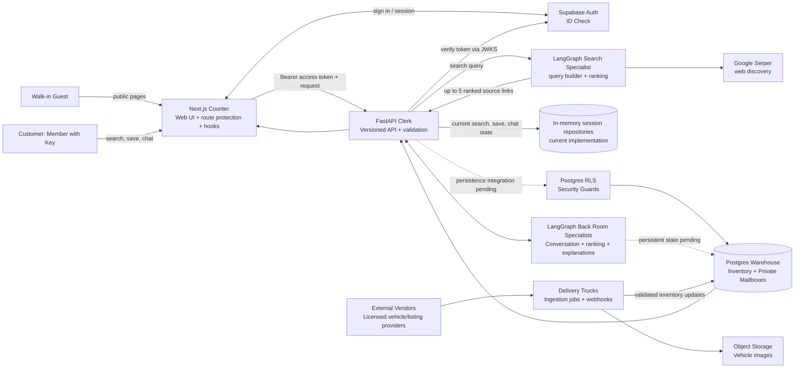
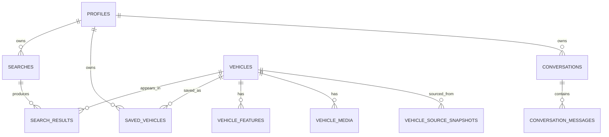

# BuySeconds — Architecture Design

## Purpose and guiding picture

BuySeconds helps a **Customer** find up to five used-car matches from a short description of their needs. In this design, the Next.js app is the **Counter**, FastAPI is the **Clerk**, Supabase Auth is the **ID Check**, Postgres is the **Warehouse**, and LangGraph workflows are the **Back Room Specialists**.

The core promise is: a Member with Key gives the Counter their car preferences, the Clerk validates the request, and the Back Room Specialists return a source-linked shortlist. In the target state, the Warehouse supplies the verified Inventory behind that shortlist.

This document separates the running application from the target production Warehouse so that the design remains accurate as implementation progresses.

## Implementation status — August 2026

| Area | Running now | Target production state |
|---|---|---|
| ID Check | Supabase browser authentication and FastAPI JWT/JWKS validation | Keep this design. |
| Counter | Next.js protected pages for search, results, saved cars, chatbot, and account | Keep this design. |
| Live discovery | LangGraph calls Google Serper through the Clerk, validates structured results, ranks up to five marketplace links, and includes city, brand, model, fuel, budget, age, and distance in the query/ranking. | Replace discovery-only web results with approved marketplace APIs or feeds for reliable, complete vehicle facts. |
| Private search, saved-car, and conversation records | FastAPI owner checks are active, but the active repositories are in-memory. Records do not survive an API restart. | Use Supabase/Postgres repositories and persist search results, saved cars, and conversation messages. |
| Warehouse | Supabase schema, RLS policies, and migrations are applied, including `searches.model` and `external_search_results`. | Connect the Clerk repositories and ingestion workers to these shelves. |
| Chat | A LangGraph workflow extracts city and fuel preference and retains the conversation for the browser/API process session. | Persist graph state and messages; add an approved model adapter only when it provides customer value. |

**Post Office analogy:** the Counter, ID Check, and Clerk are open for customers today. The Warehouse shelves have been built and guarded, but some Clerk desks still use a temporary desk drawer (in-memory repositories) rather than filing each package on the Warehouse shelf.

---

## 1. Visual data flow — Counter → Clerk → Warehouse



**Post Office analogy:** Customers never walk into the Warehouse. They speak at the Counter. The Clerk checks their ID Check pass, follows the Security Guards’ rules, and asks Back Room Specialists for work that needs ranking or intelligent conversation.

### North-star delivery flow

1. A Member with Key completes the guided search at the **Counter**, including optional brand and vehicle model.
2. The Counter sends `POST /api/v1/searches` to the **Clerk**, carrying the Supabase access token and the search criteria.
3. The Clerk validates the package with a **Quality Control Checklist**: city is required; budget, age, kilometres, brand, model, and fuel values are validated when supplied.
4. The Search Specialist builds a city-specific query and asks Google Serper for candidate links. It filters generic category pages, ranks supported marketplace links, and returns at most five source-linked results.
5. The Clerk creates a member-owned search record in the current in-memory repository and returns its `search_id`. The Counter opens `/results?searchId=…` and calls `GET /api/v1/searches/{search_id}/results`.
6. Save, remove, revisit, and chat actions use the same Counter → Clerk path. Their durable Warehouse persistence is the next implementation step.

---

## 2. Shelves in the Warehouse — PostgreSQL schema

All tables use UUID primary keys, `created_at`, and `updated_at` timestamps unless noted. The labels below are the schema contract for the Warehouse.

| Shelf (table) | Label (key columns) | Purpose and ownership |
|---|---|---|
| `profiles` | `id` FK → `auth.users.id`, `display_name`, `default_city` | Member profile and default preferences. One Private Mailbox per Member with Key. |
| `vehicles` | `id`, `make`, `model`, `variant`, `year`, `fuel_type`, `transmission`, `price_inr`, `kilometres`, `city`, `availability`, `source_listing_id`, `source_url`, `source_name`, `seller_type`, `posted_at` | Canonical vehicle Inventory. Owned by the platform, not an individual member. |
| `vehicle_features` | `id`, `vehicle_id` FK, `name` | Repeating vehicle attributes without comma-separated labels. |
| `vehicle_media` | `id`, `vehicle_id` FK, `storage_path`, `alt_text`, `sort_order` | Image labels; objects live in private object storage or an approved image delivery service. |
| `vehicle_source_snapshots` | `id`, `vehicle_id` FK, `provider`, `provider_listing_id`, `payload_json`, `fetched_at`, `expires_at` | Auditable source payloads. Restrict access to the Clerk and operations staff. |
| `searches` | `id`, `user_id` FK, `city`, `min_price_inr`, `max_price_inr`, `brand`, `model`, `fuel_type`, `max_age_years`, `max_kilometres`, `status` | A Member’s saved search request and lifecycle: `queued`, `ranking`, `ready`, `empty`, or `failed`. |
| `search_results` | `id`, `search_id` FK, `vehicle_id` FK, `rank`, `match_score`, `match_reasons`, `unmatched_reasons` | The immutable ranked package for one search. Unique `(search_id, rank)` and `(search_id, vehicle_id)`. |
| `saved_vehicles` | `id`, `user_id` FK, `vehicle_id` FK, `saved_at` | A Member’s shortlist. Unique `(user_id, vehicle_id)`; a database trigger enforces the five-car maximum. |
| `conversations` | `id`, `user_id` FK, `status`, `criteria_json`, `last_message_at` | A Member’s chat package and extracted criteria. |
| `conversation_messages` | `id`, `conversation_id` FK, `role`, `content`, `tool_data_json`, `created_at` | Ordered messages and safe tool outcomes. Do not store secrets or raw authentication tokens. |
| `provider_connections` | `id`, `provider`, `status`, `last_sync_at`, `config_reference` | Operations-only label for each External Vendor connection. Secrets remain outside this shelf. |
| `ingestion_runs` | `id`, `provider_connection_id` FK, `status`, `started_at`, `completed_at`, `records_received`, `records_written`, `error_summary` | Delivery Truck audit trail. |
| `audit_events` | `id`, `actor_user_id`, `event_type`, `entity_type`, `entity_id`, `metadata_json`, `created_at` | Tamper-resistant operational history for important Clerk actions. |

### Package Tracking System — key relationships



**Post Office analogy:** `vehicles` is shared Inventory in the Warehouse. `searches`, `search_results`, `saved_vehicles`, and conversations are private packages assigned to one Member’s Private Mailbox. Package Tracking System labels link a result to the search that produced it and the Inventory item it refers to.

### Essential indexes and constraints

- `vehicles`: indexes on `(city, availability)`, `(make, model)`, `(fuel_type)`, `(price_inr)`, `(year)`, and `(kilometres)` for fast candidate selection.
- `searches`: index on `(user_id, created_at DESC)` to retrieve only the five most recent searches.
- `search_results`: index on `(search_id, rank)` to return the ordered top five efficiently.
- `saved_vehicles`: unique `(user_id, vehicle_id)` and `(user_id, saved_at DESC)` for shortlist retrieval.
- A transaction or database function must replace a saved car atomically when a Member already holds five; no package is silently discarded.

---

## 3. Security Guard rules — access and ownership

Supabase Auth owns authentication; Supabase Postgres Row Level Security (RLS) is the Security Guard at each private Warehouse shelf. FastAPI is the trusted Clerk and must also perform authorization before doing work.

| Customer / role | Counter access | Security Guard rule |
|---|---|---|
| Walk-in Guest | Landing, sign-up, sign-in only | Cannot read or write member shelves, search results, conversations, or saved vehicles. |
| Member with Key | Search, results, product detail, My Products, Chatbot, Account | Can select, insert, update, and delete only rows whose `user_id = auth.uid()`; can read only search results belonging to their own search. |
| Platform service Clerk | Internal API and ingestion work | Uses a server-only service role only where required; never expose it to the Counter. Every access is logged. |
| Operations staff | Separate future internal tooling | No access through customer routes. Grant least privilege through a separate staff role and audit events. |

**Post Office analogy:** A Customer can open only their Private Mailbox. Security Guards check the name on every package label before allowing it out of the Warehouse. The Clerk cannot let a customer substitute someone else’s mailbox number in a request.

### RLS policy outline

- `profiles`: Members can `SELECT` and `UPDATE` only their own profile; profile creation happens through a secure Auth trigger.
- `searches`, `saved_vehicles`, `conversations`: Members can access only rows matching `auth.uid()`.
- `search_results`: Members can read rows only when the parent `searches.user_id = auth.uid()`.
- `vehicles`, `vehicle_features`, `vehicle_media`: authenticated members have read-only access to currently available Inventory; all writes are service-only.
- `vehicle_source_snapshots`, `provider_connections`, `ingestion_runs`, `audit_events`: no direct member policy; service or staff-only.

---

## 4. ID Check — Supabase Auth

Supabase Auth is the single ID Check desk for email/password sign-up, sign-in, password reset, session refresh, and logout.

1. The Counter uses Supabase’s browser client for sign-up and sign-in.
2. Supabase creates the Member’s identity in `auth.users` and issues a short-lived access pass (JWT) plus a refresh mechanism in secure cookies.
3. The Counter includes `Authorization: Bearer <access-token>` when speaking to the FastAPI Clerk.
4. The Clerk verifies the token’s signature, issuer, audience, expiry, and subject using Supabase JWKS; it never trusts a user ID supplied in request JSON.
5. The Clerk maps the verified `sub` claim to `profiles.id` and applies owner checks before reading or writing private packages.
6. A database trigger creates the `profiles` shelf row after a new ID Check identity is created.

**Post Office analogy:** Supabase checks a Customer’s identification once and gives them a time-limited entry pass. The Clerk reads the cryptographic stamp on the pass; it does not accept a handwritten claim about which mailbox belongs to the Customer.

---

## 5. Self-service screen — Counter architecture and hooks

The Next.js Counter remains responsible for presentation, accessibility, form state, optimistic feedback, and navigation. It must not calculate authoritative rankings or access Secure Keys to the Back Room.

| Counter hook / module | Clerk package it calls | Customer experience |
|---|---|---|
| `useAuthSession` | Supabase Auth | Loads the Member with Key, refreshes a session, and sends guests to sign-in while preserving the destination. |
| `useSearchDraft` | local browser draft only | Preserves unfinished form answers; does not replace the Warehouse record. |
| `useCreateSearch` | `POST /api/v1/searches` | Validates the wizard, shows the “comparing” state, then navigates to the returned `search_id`. |
| `useSearchResults(searchId)` | `GET /api/v1/searches/{id}/results` | Shows skeletons, the ordered five-match package, empty state, or retry state. |
| `useSavedVehicles` | `GET/POST/DELETE /api/v1/saved-vehicles` | Optimistically saves/removes a car and rolls back when the Clerk rejects the operation. |
| `useRecentSearches` | `GET /api/v1/searches?limit=5` | Shows the five newest packages and reruns or edits criteria. |
| `useConversation` | `POST /api/v1/conversations/{id}/messages` | Shows streamed/complete assistant replies, extracted criteria, errors, and resume state. |
| `useProfile` | `GET/PATCH /api/v1/profile` | Displays and updates default city and other approved preferences. |

**Post Office analogy:** The Counter helps a Customer fill in forms, shows the tracking status, and rings the service bell. The Counter does not keep the Warehouse keys or decide which shared Inventory package belongs to a customer.

### API resource contract

The currently implemented Clerk windows are:

- `POST /api/v1/product-search` for a direct structured product-search response.
- `POST /api/v1/searches`; `GET /api/v1/searches?limit=5`; `GET /api/v1/searches/{search_id}/results`.
- `GET /api/v1/vehicles`; `GET /api/v1/vehicles/{vehicle_id}`.
- `GET/POST/DELETE /api/v1/saved-vehicles`.
- `POST /api/v1/conversations`; `GET /api/v1/conversations/{conversation_id}`; `POST /api/v1/conversations/{conversation_id}/messages`.
- `GET /health` for service monitoring only.

The following remain part of the target API contract and are not implemented yet:

- `GET/PATCH /api/v1/profile`
- `POST /api/v1/saved-vehicles/replace` for the explicit five-car replacement transaction

The OpenAPI contract is the shipping label shared between Counter and Clerk. Generate `packages/api-client` from it; do not hand-copy request/response types.

---

## 6. Back Room Specialists — FastAPI and LangGraph

### FastAPI Clerk modules

```text
apps/api/app/
  api/v1/routes/             # Clerk service windows: HTTP endpoints
  schemas/                   # Package labels: Pydantic input/output models
  services/                  # Clerk procedures: orchestration and transactions
  repositories/              # Warehouse access: SQLAlchemy/async database queries
  auth/                      # ID-pass verification and current-member dependency
  ranking/                   # Deterministic candidate filtering and scoring
  graphs/                    # LangGraph Back Room Specialist definitions
  integrations/              # External Vendor clients and Delivery Truck adapters
  workers/                   # Scheduled ingestion and retry entry points
  observability/             # Structured logs, metrics, tracing, audit helpers
```

**Post Office analogy:** Route files are the service windows; schemas are package labels; services are the Clerk’s standard operating procedures; repositories retrieve items from the Warehouse; graphs are Back Room Specialists.

### LangGraph specialists

Two Back Room Specialists run today:

| Specialist | Responsibility | Guardrail |
|---|---|---|
| `product_search` | Builds a structured query from city, budget, brand, model, fuel, age, and distance; invokes the Google Serper tool; filters/ranks source links. | Returns no more than five Pydantic-validated listings and never fabricates vehicle details. |
| `conversation` | Maintains message order and extracts recognised city and fuel preferences. | Uses structured criteria only; it does not claim model-generated or verified vehicle facts. |

Future specialists are deliberately deferred:

| Specialist | Responsibility | Guardrail |
|---|---|---|
| `match_explanation_graph` | Turns verified ranking factors into concise “why it matches” and “trade-off” explanations. | It receives only verified vehicle and score data and labels uncertainty. |
| `conversation_recovery_graph` | Produces a clear fallback for unsupported products, ambiguous requests, or provider failures. | It preserves criteria and never exposes internal errors or secrets. |

Currently, LangGraph state is held by the API process and the frontend keeps the active conversation ID in browser session storage. The target is to store safe checkpoints and messages with `conversation_id` in the Warehouse so a Member can return after an API restart. The deterministic ranking service remains the source of truth for numerical scores; AI explains and collects, but does not override facts.

### Quality Control Checklist

- Pydantic validates every input at the Clerk window; use constrained amounts, enums, UUIDs, and maximum lengths.
- The Clerk validates the JWT before parsing owner-specific package IDs.
- Search queries are parameterized; never interpolate a Customer’s text into SQL.
- The graph sees a minimal, redacted context. Exclude API keys, access tokens, raw provider credentials, and unnecessary personal details.
- Enforce the five-result limit, five-saved-vehicle limit, per-member rate limits, timeouts, idempotency keys for mutations, and retries with backoff for Delivery Trucks.

---

## 7. External Vendors and Delivery Trucks

The current External Vendor is Google Serper, used through the Clerk for web discovery only. It provides source links and snippets, not a guaranteed, complete vehicle inventory. The Counter never connects to it directly. Approved marketplace APIs or feeds are required before BuySeconds can promise five complete, independently verified listings for every search.

| Connection | Delivery Truck design | Security rule |
|---|---|---|
| Vehicle/listing provider | Scheduled worker or signed webhook validates provider payloads, deduplicates by provider listing ID, upserts Inventory, records a source snapshot, and marks expired listings unavailable. | Use contractual/legal approval and provider-specific API keys stored only as Secure Keys to the Back Room. Do not scrape without authorization. |
| Image provider/object storage | Worker stores approved image metadata and paths; Counter receives signed or public delivery URLs only. | Validate MIME type, size, and origin; never proxy arbitrary URLs from the Customer. |
| AI model provider | LangGraph calls through a server-side adapter with timeout, retry, structured tracing, and redaction. | Model keys are server-only. Use allowlisted tools and model output validation. |
| Email provider (future) | Auth or notification worker sends password-reset and optional saved-search notifications. | Use verified templates, rate limits, and no sensitive content in logs. |

**Post Office analogy:** Delivery Trucks bring Inventory into the Warehouse through a receiving dock. The Counter is not allowed to meet a truck in the street or use its Secure Keys.

---

## 8. Reliability, observability, and performance

### Service objectives

- Counter first usable search screen: under 2.5 seconds on a mid-range mobile connection.
- Clerk search creation: acknowledge within 300 ms; complete five-match ranking within 1.5 seconds for cached/available Inventory.
- Counter feedback after a save/remove action: acknowledge within 100 ms, settle within 500 ms under normal conditions.
- Chat response: show typing/working feedback within 300 ms; return or stream the first useful response within 2 seconds when the model vendor is healthy.

### Observability

- Assign a `request_id` at the Clerk window and propagate it through repositories, graphs, and Delivery Trucks.
- Log structured event name, route, authenticated user hash/ID where appropriate, duration, status, provider, and error category.
- Emit metrics for search completion, ranking time, zero-result rate, save-limit conflicts, chat completion, provider failures, and webhook/ingestion lag.
- Trace LangGraph node execution and tool calls while redacting Customer content according to the retention policy.
- Use health checks for the Clerk and readiness checks for Warehouse connectivity and critical dependencies.

**Post Office analogy:** Every package receives a tracking number. Supervisors can see where a delivery slowed down without opening a Customer’s private letter.

---

## 9. Validated build order

### Completed foundation

1. Supabase Auth, Next.js route protection, and FastAPI JWT/JWKS validation are active.
2. Warehouse migrations and RLS policies are applied, including the customer-selected `searches.model` label.
3. The guided Counter, structured FastAPI request models, LangGraph search/conversation workflows, and source-link results are active.

### Next: connect the Clerk to the Warehouse

1. Replace `MockSearchRepository`, `MockVehicleRepository`, and `MockConversationRepository` with Supabase/Postgres repositories.
2. Persist a member search before calling the discovery provider; write the selected ranked links to `external_search_results` atomically with `status` and failure details.
3. Persist saved vehicles and conversation messages so search history and chat survive API restarts.
4. Add database-backed integration tests proving RLS ownership with two Supabase test identities.

### Then: reliable Inventory

1. Select legally approved marketplace APIs or feeds and document contracts, quotas, refresh rules, and source attribution.
2. Implement provider adapters, ingestion runs, deduplication, expiry handling, and canonical vehicle upserts.
3. Use Warehouse Inventory for strict filtering by price, age, kilometres, brand, model, fuel, and city. Google Serper remains an optional discovery fallback, not the inventory authority.

### Finally: production operations

1. Add explicit five-car replacement, profile resources, audit events, rate limits, and structured metrics.
2. Add production alerts, backup/restore drills, retention policies, performance testing, and accessibility coverage.

**Post Office analogy:** Build the ID Check and Warehouse shelves before adding Delivery Trucks. Then make the main parcel-delivery route reliable before hiring Back Room Specialists or connecting more vendors.

---

## 10. Test-driven implementation plan

Every block follows Red → Green → Refactor: write the failing test, implement the smallest correct behavior, then improve structure while keeping the test suite green.

| Block | Red test first | Green implementation | Verification |
|---|---|---|---|
| 1. Auth boundary | FastAPI rejects missing, expired, malformed, or wrong-issuer JWTs; Counter protects a private route. | `current_member` dependency, Supabase browser session, protected-route hook. | Sign up, refresh, sign out, and direct protected-link return flow. |
| 2. RLS ownership | Member A cannot read or mutate Member B’s search, saved vehicle, or conversation. | Migrations and RLS policies; owner-scoped repository methods. | Run integration tests using two Supabase test identities. |
| 3. Vehicle Inventory | Invalid source payload is rejected; valid vehicle is stored once; expired item is hidden. | Vehicle schemas, repository, ingestion idempotency. | API response schema and Inventory query tests. |
| 4. Search and ranking | Invalid criteria return 422; a known Inventory fixture returns five stable ranks and reasons. | Search service, ranking function, result persistence. | API contract test plus Counter wizard-to-results test. |
| 5. Product detail | Unknown vehicle returns product-specific unavailable response; source URL is allowlisted. | Vehicle detail service and safe external-link fields. | Route and UI empty/error/success tests. |
| 6. Saved vehicles | Sixth save returns replacement-required; replacement is atomic; duplicate save is idempotent. | Transaction/database function and saved-vehicle service. | Concurrent integration tests and optimistic Counter rollback test. |
| 7. Recent searches/profile | Only five newest member searches return; profile update cannot affect another member. | Resource endpoints and hooks. | API, RLS, and React Testing Library tests. |
| 8. LangGraph conversation | Missing city causes exactly one follow-up question; unsupported item has a safe response; graph never changes verified score. | Graph nodes, typed state, tool adapters, checkpoints. | Deterministic graph unit tests plus API conversation tests. |
| 9. Vendor delivery | Duplicate webhook does not duplicate Inventory; vendor timeout produces retryable failed run. | Signed webhook verification, worker, retries, audit events. | Provider-adapter contract tests with recorded fixtures. |
| 10. Non-functional checks | Performance budgets and error alerts fail when thresholds are exceeded. | Metrics, tracing, rate limits, load scripts, dashboards. | Load test, accessibility scan, and recovery drill. |

### Definition of done for each block

- The Quality Control Checklist has tests for success, validation failure, authorization failure, and recoverable dependency failure.
- The Counter has accessible loading, empty, error, and success states with keyboard coverage.
- The OpenAPI shipping label and generated API client are updated together.
- RLS tests prove no Private Mailbox leakage.
- Logs and metrics include the tracking number but no Secure Keys or sensitive Customer data.
- The build, unit tests, API tests, and relevant integration tests pass before approval.

---

## Architecture handoff

The foundation and live-discovery path have been implemented and validated against the codebase. The next approved implementation block is **connect the Clerk repositories to the Supabase Warehouse**, starting with searches and `external_search_results`. This is the dependency that makes search history, chat history, and source-linked results durable across API restarts.
