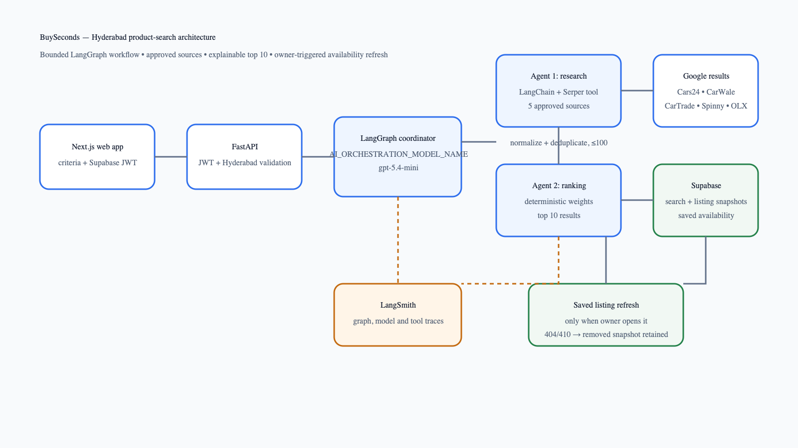
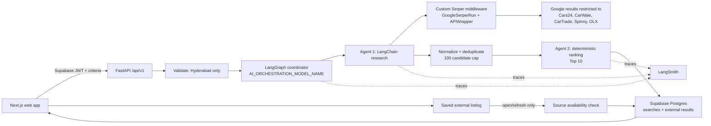

# BuySeconds architecture

BuySeconds is a monorepo with a Next.js customer application and an independently deployable Python/FastAPI API. Product search is an authenticated, Hyderabad-only workflow backed by LangGraph, LangChain, Google Serper, Supabase Postgres, and LangSmith.

## Components

| Component | Responsibility |
| --- | --- |
| `apps/web` | Collects criteria, sends the customer JWT, shows rankings/source links, and opens saved listings. |
| FastAPI | Validates JWT and request data, owns the API contract, applies owner checks, and returns recoverable errors. |
| LangGraph | Coordinates validation, research, normalization, ranking, persistence, and response. |
| LangChain agents | Research agent selects approved source queries and calls Serper middleware; ranking agent explains deterministic results without changing scores. |
| Google Serper | Discovers public Google results; it is discovery evidence, not verified inventory. |
| Supabase Postgres | Persists member searches, external result snapshots, scores, saved external listings, and availability state. |
| LangSmith | Captures live graph, model, and tool traces. |

## Product-search flow

1. An authenticated customer submits vehicle criteria to `POST /api/v1/searches` or `POST /api/v1/product-search`.
2. Pydantic validates the request, including the Hyderabad-only constraint and valid price range.
3. The LangGraph coordinator uses `AI_ORCHESTRATION_MODEL_NAME`—initially `gpt-5.4-mini`—in live mode.
4. Agent 1 uses a LangChain custom tool that wraps `GoogleSerperRun` and `GoogleSerperAPIWrapper`. Queries are restricted to the five approved domains.
5. Candidate records are normalized from source evidence, canonical URLs are deduplicated, unapproved sources are discarded, and the set is capped at 100.
6. Agent 2 calculates a deterministic score: city 20%, price 25%, brand/model 25%, fuel 10%, age 10%, and kilometres 10%.
7. The top 10 records receive ranks and score explanations. Search and external-result snapshots persist when `DATABASE_URL` is configured.
8. The API returns source-linked rankings to the web app.

## Saved external listings

Saved external listings point to a persisted external search result rather than copying an untraceable browser URL. On `GET /api/v1/saved-listings/{id}`, the API requests the original source URL:

- HTTP 404 or 410: mark the saved record `removed` and retain its snapshot.
- Other successful responses: mark it `available`.
- Network or provider errors: retain its current status; do not remove a listing on a transient failure.

There is no background polling or scheduled deletion.

## Data and security boundaries

- The browser receives only public Supabase configuration and short-lived user access tokens.
- OpenAI, Serper, LangSmith, and database credentials remain server-side.
- FastAPI verifies Supabase JWTs and routes member-scoped operations through ownership-aware repositories.
- Supabase Row Level Security protects `searches`, `external_search_results`, and `saved_external_listings` for direct database access.
- Raw Serper payload is persisted for auditability; no secrets or authorization data may be written to result payloads or logs.

## Configuration and operations

`AI_ORCHESTRATION_MODEL_NAME` is the single shared model setting for the LangGraph coordinator and both product-search agents. `PRODUCT_SEARCH_MODE=mock` provides deterministic tests without paid calls. `live` requires valid OpenAI, Serper, LangSmith, and database configuration.

Apply [the ranked external-listings migration](../supabase/migrations/20260829140000_ranked_external_listings.sql) before enabling live persistence. Run the API test suite, Ruff, and Black checks before deploying.
